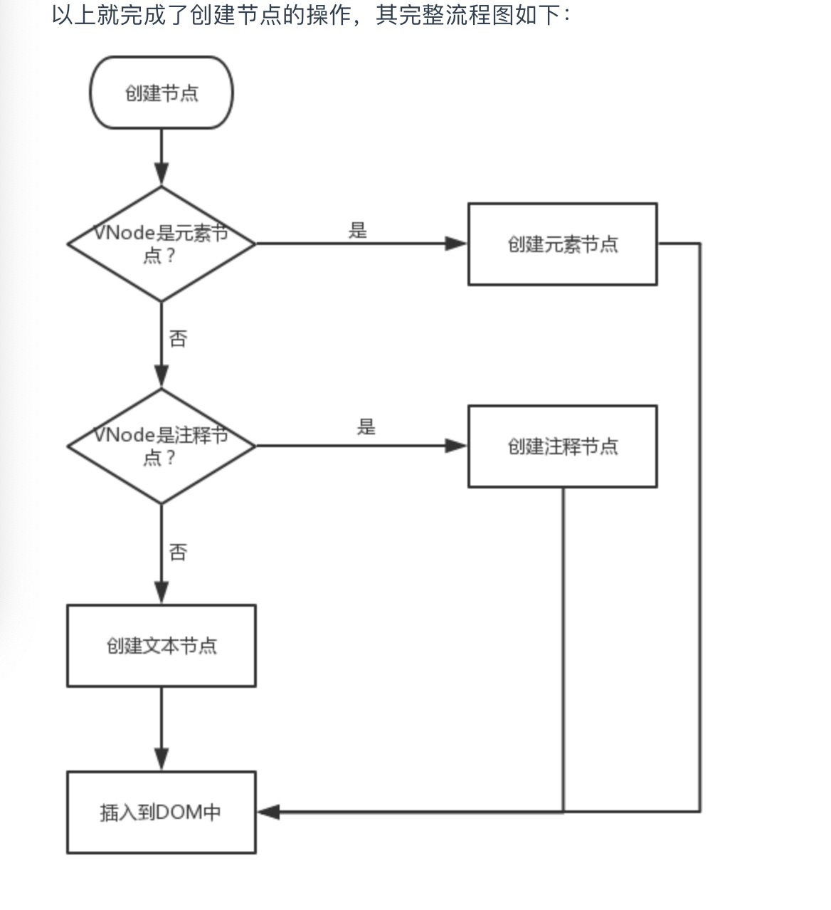

[TOC]
# 如何高效操作DOM
### 什么是DOM
>DOM（Document Object Model，文档对象模型）是 JavaScript 操作 HTML 的接口.
### 浏览器真实解析DOM的流程
### 为什么说操作DOM耗时
> * 线程切换 
>>  浏览器包含渲染引擎（也称浏览器内核）和 JavaScript 引擎，它们都是单线程运行。单线程的优势是开发方便，避免多线程下的死锁、竞争等问题，劣势是失去了并发能力。
  浏览器为了避免两个引擎同时修改页面而造成渲染结果不一致的情况，增加了另外一个机制，这两个引擎具有互斥性，也就是说在某个时刻只有一个引擎在运行，另一个引擎会被阻塞。操作系统在进行线程切换的时候需要保存上一个线程执行时的状态信息并读取下一个线程的状态信息，俗称上下文切换。而这个操作相对而言是比较耗时的。
>  * 重新渲染
>> 另一个更加耗时的因素是元素及样式变化引起的再次渲染，在渲染过程中最耗时的两个步骤为重排（Reflow）与重绘（Repaint）。
浏览器在渲染页面时会将 HTML 和 CSS 分别解析成 DOM 树和 CSSOM 树，然后合并进行排布，再绘制成我们可见的页面。如果在操作 DOM 时涉及到元素、样式的修改，就会引起渲染引擎重新计算样式生成 CSSOM 树，同时还有可能触发对元素的重新排布（简称“重排”）和重新绘制（简称“重绘”）。
可能会影响到其他元素排布的操作就会引起重排，继而引发重绘，比如：
>>> * 修改元素边距、大小
>>> * 添加、删除元素
>>> * 改变窗口大小

>> 与之相反的操作则只会引起重绘，比如：
>>> * 设置背景图片
>>> * 修改字体颜色
>>> * 改变 visibility 属性值
### 如何高效操作DOM
* 在循环外操作元素
* 批量操作元素
* 缓存元素集合
# 虚拟DOM
### 什么是虚拟DOM
> 是以javascript对象作为基础的树，用对象的属性来描述节点，并且该对象最少包含标签名( tag)、属性(attrs)和子元素对象( children)三个属性。最终可以通过一系列操作使这棵树映射到真实环境上。
### 为什么要有虚拟DOM
> （用vue举例），vue是数据驱动视图更新的，所以当数据变化的时候，视图也要更新，视图更新是需要操作DOM的，操作真实的DOM是非常消耗性能的
所以可以利用js的计算性能来换取操作DOM所消耗的性能，即，当视图要更新的时候，通过对比数据变动前后的状态，计算出视图哪些地方需要更新，只更新需要更新的地方，其他的不需要的不用关心，这样就减少了操作DOM,用js模拟出虚拟DOM,将更新前的虚拟和新的虚拟DOM进行对比，然后更新视图。
### 虚拟DOM的作用
>虚拟DOM在Vue.js主要做了两件事：
> * 提供与真实DOM节点所对应的虚拟节点vnode
> * 将虚拟节点vnode和旧虚拟节点oldVnode进行对比，然后更新视图
### Vue中的虚拟DOM是如何实现的
> Vue中通过一个vnode类来实例化出不同类型的虚拟DOM节点，即，每次传入的参数不同即可实例化出不同的节点类型。可以描述出以下几种类型的节点：
>> * 注释节点
>> * 文本节点
>> * 元素节点
>> * 组件节点
>> * 函数式组件节点
>> * 克隆节点
 ```JavaScript
// 源码位置：https://github.com/vuejs/vue/blob/dev/src/core/vdom/vnode.js

export default class VNode {
  constructor (
    tag?: string,
    data?: VNodeData,
    children?: ?Array<VNode>,
    text?: string,
    elm?: Node,
    context?: Component,
    componentOptions?: VNodeComponentOptions,
    asyncFactory?: Function
  ) {
    this.tag = tag                                /*当前节点的标签名*/
    this.data = data        /*当前节点对应的对象，包含了具体的一些数据信息，是一个VNodeData类型，可以参考VNodeData类型中的数据信息*/
    this.children = children  /*当前节点的子节点，是一个数组*/
    this.text = text     /*当前节点的文本*/
    this.elm = elm       /*当前虚拟节点对应的真实dom节点*/
    this.ns = undefined            /*当前节点的名字空间*/
    this.context = context          /*当前组件节点对应的Vue实例*/
    this.fnContext = undefined       /*函数式组件对应的Vue实例*/
    this.fnOptions = undefined
    this.fnScopeId = undefined
    this.key = data && data.key           /*节点的key属性，被当作节点的标志，用以优化*/
    this.componentOptions = componentOptions   /*组件的option选项*/
    this.componentInstance = undefined       /*当前节点对应的组件的实例*/
    this.parent = undefined           /*当前节点的父节点*/
    this.raw = false         /*简而言之就是是否为原生HTML或只是普通文本，innerHTML的时候为true，textContent的时候为false*/
    this.isStatic = false         /*静态节点标志*/
    this.isRootInsert = true      /*是否作为跟节点插入*/
    this.isComment = false             /*是否为注释节点*/
    this.isCloned = false           /*是否为克隆节点*/
    this.isOnce = false                /*是否有v-once指令*/
    this.asyncFactory = asyncFactory
    this.asyncMeta = undefined
    this.isAsyncPlaceholder = false
  }

  get child (): Component | void {
    return this.componentInstance
  }
}
```
### diff算法
>在Vue中，把 DOM-Diff过程叫做patch过程。patch,意为“补丁”，即指对旧的VNode修补，打补丁从而得到新的VNode，非常形象哈。
> 那不管叫什么，其本质都是把对比新旧两份VNode的过程。我们在下面研究patch过程的时候，一定把握住这样一个思想：所谓旧的VNode(即oldVNode)就是数据变化之前视图所对应的虚拟DOM节点，而新的VNode是数据变化之后将要渲染的新的视图所对应的虚拟DOM节点，所以我们要以生成的新的VNode为基准，对比旧的oldVNode,
> 如果新的VNode上有的节点而旧的oldVNode上没有，那么就在旧的oldVNode上加上去；如果新的VNode上没有的节点而旧的oldVNode上有，那么就在旧的oldVNode上去掉；
>如果某些节点在新的VNode和旧的oldVNode上都有，那么就以新的VNode为准，更新旧的oldVNode，从而让新旧VNode相同。
> 总之一句话：***以新的VNode为基准，改造旧的oldVNode使之成为跟新的VNode一样，这就是patch过程要干的事。***
> 整个patch无非就是干三件事：
> * 创建节点：新的VNode中有而旧的oldVNode中没有，就在旧的oldVNode中创建。
> * 删除节点：新的VNode中没有而旧的oldVNode中有，就从旧的oldVNode中删除。
> * 更新节点：新的VNode和旧的oldVNode中都有，就以新的VNode为准，更新旧的oldVNode。

#### 创建节点
>VNode类可以描述6种类型的节点，而实际上只有3种类型的节点能够被创建并插入到DOM中，它们分别是：元素节点、文本节点、注释节点。所以Vue在创建节点的时候会判断在新的VNode中有而旧的oldVNode中没有的这个节点是属于哪种类型的节点，从而调用不同的方法创建并插入到DOM中。
```JavaScript
// 源码位置: https://github.com/vuejs/vue/blob/dev/src/core/vdom/patch.js
function createElm (vnode, parentElm, refElm) {
    const data = vnode.data
    const children = vnode.children
    const tag = vnode.tag
    if (isDef(tag)) {
      	vnode.elm = nodeOps.createElement(tag, vnode)   // 创建元素节点
        createChildren(vnode, children, insertedVnodeQueue) // 创建元素节点的子节点
        insert(parentElm, vnode.elm, refElm)       // 插入到DOM中
    } else if (isTrue(vnode.isComment)) {
      vnode.elm = nodeOps.createComment(vnode.text)  // 创建注释节点
      insert(parentElm, vnode.elm, refElm)           // 插入到DOM中
    } else {
      vnode.elm = nodeOps.createTextNode(vnode.text)  // 创建文本节点
      insert(parentElm, vnode.elm, refElm)           // 插入到DOM中
    }
  }
```

#### 删除节点
>如果某些节点再新的VNode中没有而在旧的oldVNode中有，那么就需要把这些节点从旧的oldVNode中删除。
>删除节点非常简单，只需在要删除节点的父元素上调用removeChild方法即可。
```JavaScript
function removeNode (el) {
    const parent = nodeOps.parentNode(el)  // 获取父节点
    if (isDef(parent)) {
      nodeOps.removeChild(parent, el)  // 调用父节点的removeChild方法
    }
  }
```
#### 更新节点
> 不管数据再怎么变化，只要这个节点第一次渲染了，那么它以后就永远不会发生变化，这是因为它不包含任何变量，所以数据发生任何变化都与它无关。我们把这种节点称之为静态节点。
>更新节点的时候我们需要对以下3种情况进行判断并分别处理：
>* 如果VNode和oldVNode均为静态节点
>
>我们说了，静态节点无论数据发生任何变化都与它无关，所以都为静态节点的话则直接跳过，无需处理。
>* 如果VNode是文本节点
>
>如果VNode是文本节点即表示这个节点内只包含纯文本，那么只需看oldVNode是否也是文本节点，如果是，那就比较两个文本是否不同，如果不同则把oldVNode里的文本改成跟VNode的文本一样。如果oldVNode不是文本节点，那么不论它是什么，直接调用setTextNode方法把它改成文本节点，并且文本内容跟VNode相同。
>
>* 如果VNode是元素节点
>如果VNode是元素节点，则又细分以下两种情况：
>该节点包含子节点
>如果新的节点内包含了子节点，那么此时要看旧的节点是否包含子节点，如果旧的节点里也包含了子节点，那就需要递归对比更新子节点；如果旧的节点里不包含子节点，那么这个旧节点有可能是空节点或者是文本节点，如果旧的节点是空节点就把新的节点里的子节点创建一份然后插入到旧的节点里面，如果旧的节点是文本节点，则把文本清空，然后把新的节点里的子节点创建一份然后插入到旧的节点里面。
>该节点不包含子节点
>如果该节点不包含子节点，同时它又不是文本节点，那就说明该节点是个空节点，那就好办了，不管旧节点之前里面都有啥，直接清空即可。
