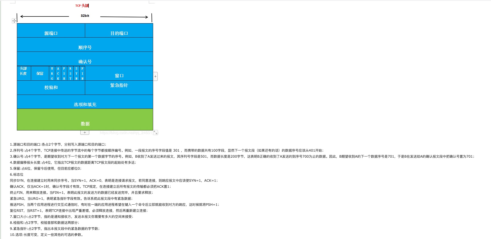

1. img元素是行内元素，为什么可以设置宽高？
> img属于可替换元素，里面的src属性引用的资源如图片有默认宽高，所以可设置。
2. Html中header的meta标签
[https://blog.csdn.net/weixin_34235371/article/details/88939733](https://blog.csdn.net/weixin_34235371/article/details/88939733)
3. css精灵图 
[https://blog.csdn.net/W_mizi/article/details/83719653](https://blog.csdn.net/W_mizi/article/details/83719653)
4. 如何判断对象为空
> 1. json对象转化为字符串，再判断是否与'{}'相等；2. for in循环；3.object.keys将属性存到数组，返回数组长度是否为0；
5. 简单叙述XHR发送请求的过程
[https://blog.csdn.net/qq_33737087/article/details/103992431](https://blog.csdn.net/qq_33737087/article/details/103992431)
6. Object.assign的作用
[https://www.jianshu.com/p/d5f572dd3776](https://www.jianshu.com/p/d5f572dd3776)
7. 微观任务/宏观任务执行顺序，微观任务创建的微观任务怎么执行？那AJAX什么时候执行？
> 微任务被放在了事件队列中，先与宏任务执行，ajax属于宏任务，先执行。
8. 为什么要有同源策略？
>同源策略就是协议域名端口号相同，如果没有同源策略，那么不同网站之间就可以互相访问数据。同源策略很重要的是对cookie的一个保护，cookie里面存放着用户的重要信息，如果用户登录了A网站，再去访问B网站，那么B网站就能通过js拿到document.cookie获取用户登录信息，这样就产生了CSRF攻击，但是同源策略是无法完全防御CSRF的，这里需要服务器端配合。
9. vue3和vue2
10. 链表是否有环

```javascript

   //判断链表是否有环  快慢指针
        function judge(link){
            var fast = link,slow = link;
            while(link != null && link.next != null){
                fast = link.next.next;
                slow = link.next;
                if(fast == slow){
                    console.log('有环',link);
                    return true;
                }
            }
            return false;
        }

```

11. 前端工程化
>模块化，组件化，前端规范
12. 数组扁平去重升序
```javascript
[...new Set(arr.join.split(','))].sort((a,b)=>a-b).map(Number)
```

13. 手写js继承
14. 手写ajax,用promise实现一个
15. 判断数据类型的方法有哪些，几种方法的优缺点和区别
16. 原型链方法判断数据类型的原理
> `Object.prototype.toString.call`，通过call改变了this指向，进而改变了toString的上下文。
toString是Object原型对象上的一个方法，该方法默认返回其调用者的具体类型，更严格的讲，是 toString运行时this指向的对象类型,
17. [] ==  0, 输出什么？== 跟=== 区别，==的类型隐式转换规则
18. 闭包是什么？应用场景有哪些？如何释放闭包?
> 闭包是外部函数访问内部函数变量。（结合作用域链）。应用场景：1.setTimeout，原生的传递的第一个函数不能带参数，闭包可以实现。2.回调。定义事件行为，将行为作为回调，绑定到事件上。3.函数防抖和节流。4.封装私有变量。5.节点循环绑定click事件。
19. promise.all的内部原理，能不能实现一下
20. 说一下websocket原理
21. HTTP1.1和HTTP2的区别
22. 如何不刷新页面加载数据
23. 为什么要三次握手 而不是两次
24. webpack打包后的代码看过吗 原理说一下
25. weakMap weakSet
26. 不可变数据实现
27. diff算法
28. 快排的实现
29. 前端路由实现
30. 二分查找一个含有n个数的数组要多少次
31. 只要1G的内存，要对一个50个G大的文件按某个属性排序，实现方案
32. 实现一下大量数据的渲染
33. 有一个乱序的数组，找到数组中第二大的数。
34. HTTP和HTTPS的定义和区别，HTTPS的优缺点有哪些，什么场景使用HTTP，什么场景使用HTTPS
35. 怎么实现页面中照片的上传，用什么方法，文本输入使用的是什么标签？
36. 在CSS3中关于动画的属性有哪些？怎么实现一个动画的旋转，怎么实现动画的移动？
37. localStorage sessionStorage区别（可以跨域获取吗）
38. 搜索引擎优化语义标签不识别怎么办
39. 怎么消除递归
40. 获取当前时间，并格式化化为‘yyyy-mm-dd’格式.再补充一个可以传入时间格式的通用格式化时间函数
41. 获取url里的参数，比如www.baidu.com?a=1&b=2
42. 'abc123'用正则提炼数字
43. 写一个方法，获取参数的数据类型
44. 优化首屏渲染方法。
45. 简单讲一下loader和plugin的区别吧
> loader是加载器，将js不支持的格式或者资源转换成支持的格式，plugin自己去设计功能函数，在暴露出来的生命周期钩子中调用，相当于是对webpack的功能的增强
46. 清除浮动。
47. 说一下伪类和伪元素的区别？
>* 伪元素是用来创建一开始没有存在dom树上的元素，这些元素可以被用户看到，不会改变文档内容，不会出现在dom中，仅仅是在css渲染层加入。
>* 伪类表示已经存在的某个元素处于某种状态，dom树无法表示这种状态，就可以用伪类来添加样式。
>* 伪元素与伪类的根本区别在于：操作的对象元素是否存在于原来的dom结构里。
48. webpack依赖是如何打包的？
49. 说说事件循环
>思路：浏览器进程---任务队列--宏任务微任务--事件循环
>> 浏览器是多进程的，每一个tab页都是一个进程，浏览器的渲染进程就是其中之一，主要负责页面渲染，脚本执行，事件处理，其中包含的线程有:GUI渲染线程、js引擎线程、事件触发线程、定时器触发线程、http请求线程等。
>> 其中js引擎是主线程，在主线程里有一个任务队列，一般同步任务会进入到主线程中执行，而异步任务会通过任务队列机制来进行协调，当主线程中的任务执行完毕后，会在任务队列里面选择任务，优先选择微任务，如：promise、async await等，再选择宏任务，如：setTimeout.每当主线程任务执行完毕，都会到任务队列中选择，循环下来就是事件循环。
50. TCP和UDP的区别？
>* tcp是面向连接的，由于有超时重传等机制，所以数据是可靠的，是以字节流的形式传输数据，，只能是一对一通信，全双工通信，首部最小20个字节，最大60个字节。
>* udp是面向无连接的，以报文的形式发送数据，数据是不可靠的，可以一对多，多对多，多对一。首部仅8个字节。
51. 为什么说UDP是不可靠的？
>首先不可靠体现在无连接上，想发就发，并且收到什么数据发送什么数据，也不会关心对方是否收到。
52. 说一下TCP报文头部的结构。

